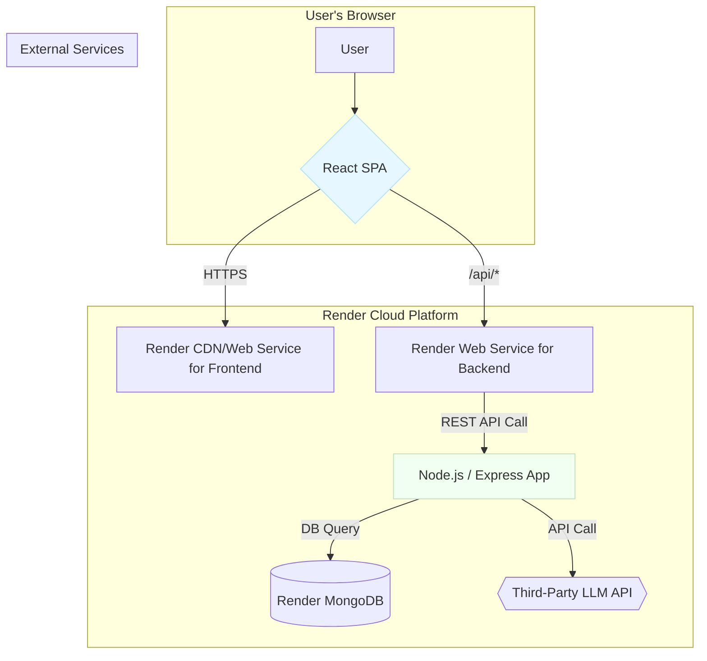

# High Level Architecture

## Technical Summary

The "Mini AI App Builder" will be a modern fullstack application featuring a monolithic backend and a single-page application (SPA) frontend, managed within a single monorepo. The architecture is designed for rapid development and deployment on Render, prioritizing simplicity and adherence to the PRD's constraints. The frontend will be a React application built with Vite and styled with Tailwind CSS. It will communicate with a backend Node.js/Express server via a simple REST API. This backend will handle the core business logic, orchestrating calls to a third-party LLM API for AI-powered requirement extraction. All components, including a MongoDB database, will be hosted on Render to maintain a streamlined and cost-effective infrastructure.

## Platform and Infrastructure Choice

We will use Render as the primary cloud platform. It provides a seamless developer experience for deploying fullstack applications and meets the PRD's requirement for a provider with a generous free tier.

- **Platform:** Render
- **Key Services:**
  - **Render Web Service:** Two services will be used; one for hosting the static React frontend and another for the Node.js backend API.
  - **Render MongoDB:** A managed MongoDB instance for any data persistence needs.
  - **Render Environment Groups:** To share environment variables securely between the frontend and backend services.
- **Deployment Host and Regions:** Services will be deployed to a US region (e.g., `Oregon (US West)` or `Ohio (US East)`).

## Repository Structure

We will adopt a monorepo structure, managed with Turborepo and npm workspaces.

- **Structure:** Monorepo
- **Monorepo Tool:** **Turborepo** on top of **npm workspaces**.
- **Package Organization:**
  - `apps/`: Will contain the deployable applications (`web` for the frontend, `api` for the backend).
  - `packages/`: Will contain shared code, such as TypeScript types, shared configurations, and potentially a shared UI component library.

## High Level Architecture Diagram

## Architectural Patterns

- **Monolith (Backend):** The backend will be a single, unified service for simplicity and speed.
- **Single-Page Application (SPA):** The frontend will be a client-side rendered React application for a fluid user experience.
- **Monorepo:** All code will reside in a single repository to facilitate code sharing and streamlined builds.
- **Repository Pattern (Backend):** Database logic will be abstracted from business logic to decouple the application from the data source.
- **Utility-First CSS:** Using Tailwind CSS for all styling as required by the `front-end-spec.md`.
