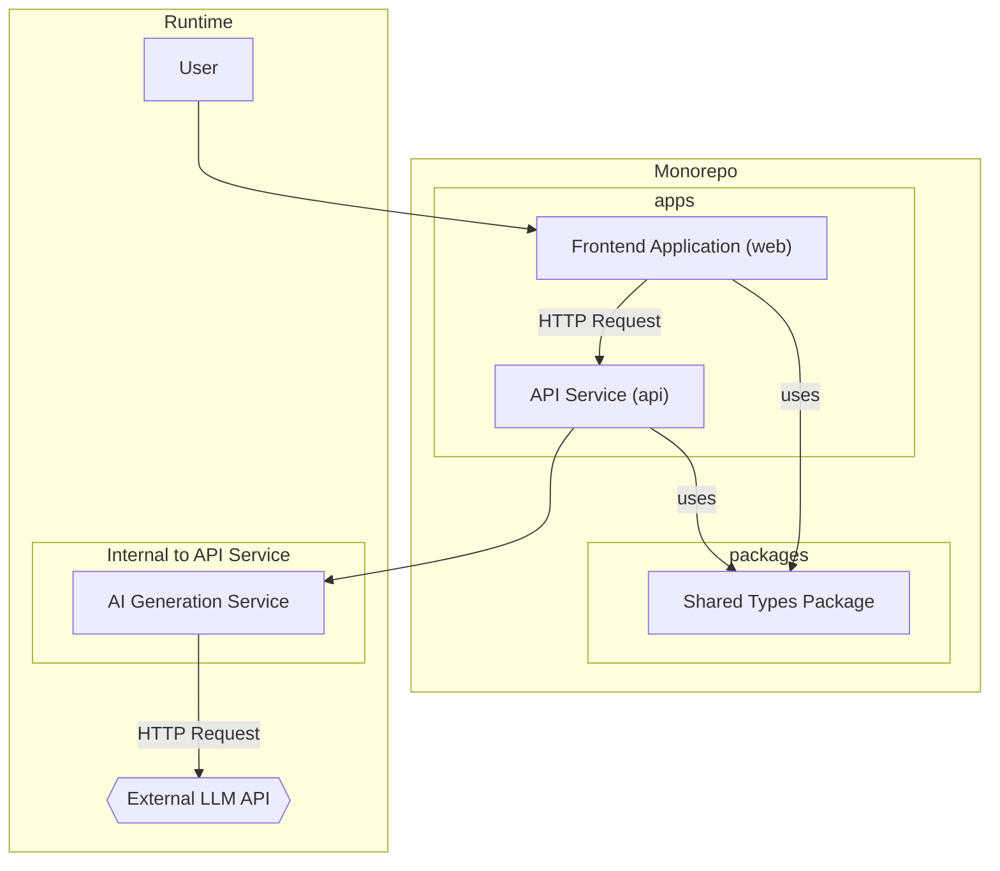

# Components

The application is broken down into these major logical blocks.

*   **Frontend Application (`web`):** The React SPA that the user interacts with. It renders the UI and communicates with the API.
*   **API Service (`api`):** The backend Express server that exposes the REST API, handles requests, and orchestrates the generation process.
*   **AI Generation Service:** A logical service within the `api` app responsible for all communication with the external LLM provider.
*   **Shared Types Package (`packages/shared-types`):** A non-runnable package that exports the shared TypeScript interfaces, ensuring type safety across the stack.

